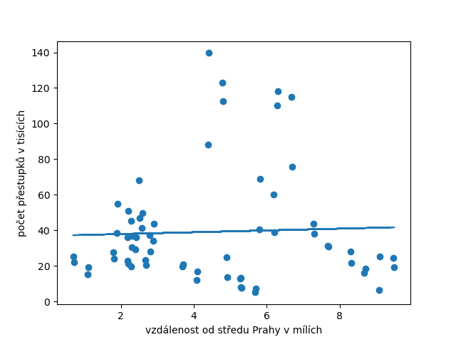

# Statistická práce

V rámci statistické práce zkoumám závislost dopravních přestupků na vzdálenosti od středu Prahy.   
Jako střed Prahy jsem zvolil [bod](https://en.mapy.cz/zakladni?x=14.4741105&y=50.0936118&z=15&source=base&id=2340226).

Hypotéza H0: Počet dopravních přestupků závisí na vzdálenosti od středu Prahy  
Alternativní H1: Počet dopravních přestupků na vzdálenosti vůbec nezávisí
na vzdálenosti

## Data

Data byla zabalena do zipu, abych nemusel používat git pro velké soubory

### Přestupky

Přestupky byly sebrány z [otevřených dat Prahy](https://opendata.praha.eu/dataset/dopravni-prestupky-mhmp-2020/resource/83bb001b-8074-4ae9-8b6f-961aa7e6a92f), přes roky 2018-2021,
a jsou k dispozici uvnitř souboru [data.csv](./data.csv).
Data je třeba lehce předzpracovat, neboť v nich 
neexistuje standardizované názvy různých částí Prahy. 
Toto jsem se rozhodl řešit, že jsem udělal sumu přestupků 
a dal minimální hranici 1000 přestupůk, aby se ta data počítala.

### Vzdálenost

Pro zbylé části, které nebyly vyřazeny, jsem potřeboval získat vzdálenost.
V souboru [vzdalenost.csv](./vzdalenosti.csv) je, pro každou zbylou
část spočítána, vzdálenost od středu Prahy. Vždy jsem v každé 
městské části zvolil jeden bod, který mi přišel zhruba jako střed.
Zvolené body a přímky, podle kterých jsem počítal vzdálenost,
jsou v souboru [casti.json](./casti.json). Vzdálenost jsem počítal
s pomocí aplikace [http://geojson.io/](http://geojson.io/), kde 
se mi nepodařilo najít konverzi na km, tak jsou vzdálenosti v mílích.
Jelikož vzdálenost je jako taková hodně nepřesán, tak jsem se rozhodl
ji pro každý rok lehce posunout v rámci městské části. Konkrétně o
`(rok - 2000)/100`, dále nebo blíže ke středu podle toho, zda byl lichý
nebo sudý rok, ať lehce eliminuji můj nepřesný výběr vzdálenosti.

## Lineární regrese

Jako alfa-hodnotu si zvolím klasicky `0.05` a provedu lineární regresi.

Z lineární regrese dostanu p-hodnotu přibližně `0.75`, 
což je velmi vysoko nad hranicí `0.05`. Tedy nulovou hypotézu
určitě nemůžu zamítnout podle zpracovaných dat.
 
